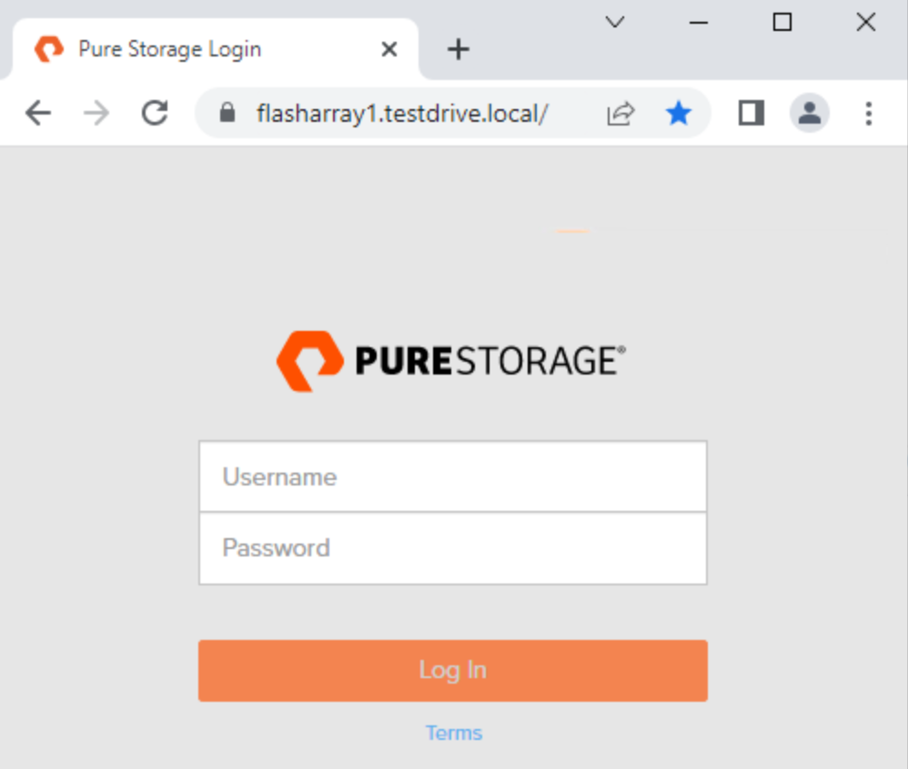
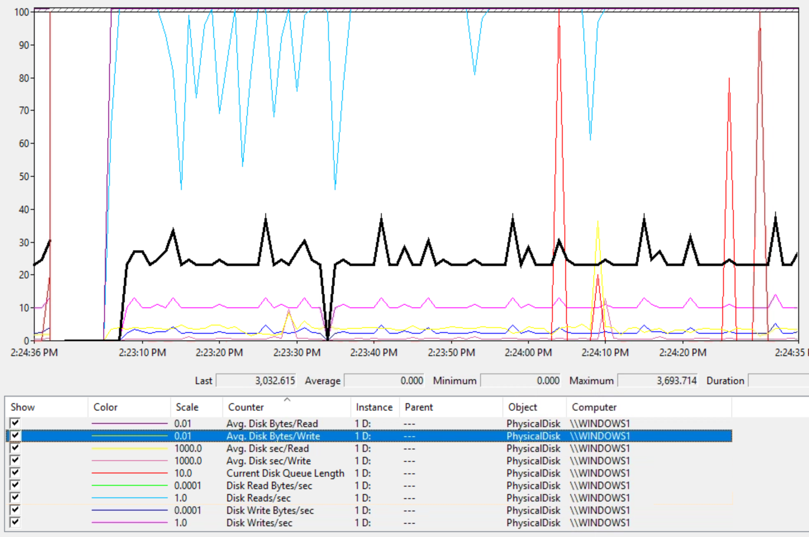

# Workshop: Modern Storage Platforms for SQL Server

#### <i>A Course from the Pure Storage Field Solution Architecture team</i>

## Module 1 - Storage fundamentals for DBAs


## 1.1 - Loging into the lab
---
TODO - DESCRIPTION

TODO - ACTIVITY


## 1.2 - Log into FlashArray Web Interface
---
In this lab you will log into the FlashArray web interface. The web interface is where you can configure and monitor your FlashArray. 


- Click on the Google Chrome for FlashArray1 icon on the desktop. This will open to https://flasharray1.testdrive.local


- Username: pureuser / Password: pureuser


**<i>Tip - Click Fit to Window to size the virtual desktop to your browser window. </i>**


<br />

## 1.3 - Start up a database workload
---
In this lab you will start a database workload. 

In the demos folder, run the script workload.cmd. This will launch a read and write workload against the database. Leave this workload running for the next activity.

- Open SQL Server Management Studio
- Log in with Windows Authentication
- Click New Query in the toolbar
- Paste this code into the window

    ```
    USE TPCC100

    WHILE 1 = 1 
    SELECT * FROM customer
    ```

- Leave this query running


## 1.4 - View metrics in the FlashArray Web Interface, Perfmon and SQL Server
---
- Click on the Google Chrome for FlashArray1 icon
- Nagigate to the Performance page. In the left menu bar, under Analysis, click Performance. Right now you are looking at the averages for the Read, Write and Mirrored Write IO types. To examine one type of IO such as read, uncheck the Write and Mirrored Write checkboxes above the charts.  Then take your mouse and hover over a point in the chart to examine more deeper dive values. You should see output similar to the screenshot below.


- Examine the critical performance metrics for read and write. You can view the different types of IO by checking or un checking read or write. Mirrored Write is a special consideration when using array based replication.
    - Latency
    - IOPs
    - Bandwitdh


- On the desktop, launch the Microsoft Management Console named **Disk Performance Metrics**
    - Examine the critical performance metrics
        - Latency
        - IOPs
        - Bandwitdh



- On the desktop, launch **SQL Server Management Studio**
- Open the query named [`diskperformancemetrics.sql`](./demos/m1/diskperformancemetrics.sql), execute the query.
- Username sa/pureuser


- Terminate the query running from activity 1.3

---

## More Resources
- [Understanding SQL Server IO Size](https://www.nocentino.com/posts/2021-12-10-sqlserver-io-size/)
- [Measuring SQL Server File Latency](https://www.nocentino.com/posts/2021-10-06-sql-server-file-latency)


Next, Continue to [Storage based snapshots and SQL Server](./2-StorageSnapshotsForSqlServer.md)
